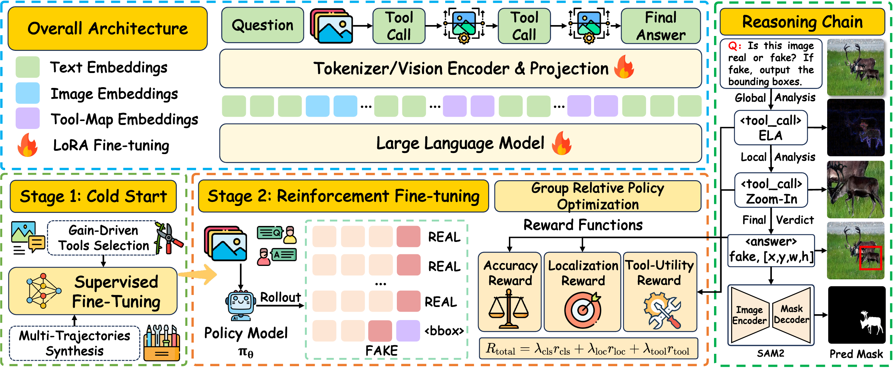

<div align="center">

# ForgeryVCR: Visual-Centric Reasoning via Efficient Forensic Tools in MLLMs for Image Forgery Detection and Localization

### 🎉 ACM Multimedia 2026 - $\color{red}{\textsf{Oral}}$

**Youqi Wang<sup>1,2&#42;†</sup> · Shen Chen<sup>2&#42;♠</sup> ·
Haowei Wang<sup>2</sup> · Rongxuan Peng<sup>1</sup> ·
Taiping Yao<sup>2</sup> · Shunquan Tan<sup>1✉</sup> ·
Changsheng Chen<sup>1</sup> · Bin Li<sup>1</sup> ·
Shouhong Ding<sup>2✉</sup>**

<sup>1</sup> 深圳大学　　<sup>2</sup> 腾讯优图实验室

<sup>&#42;</sup>共同一作。　<sup>♠</sup>项目负责人。　
<sup>✉</sup>通讯作者。　<sup>†</sup>相关工作于腾讯优图实习期间完成。

[](https://arxiv.org/abs/2602.14098)
[](https://youqiwong.github.io/projects/ForgeryVCR/)
[](https://huggingface.co/youqiwong/ForgeryVCR)
[](LICENSE)

[English](README.md) | **简体中文**

[模型权重](https://huggingface.co/youqiwong/ForgeryVCR) ·
[评估数据准备](#3-模型与评估数据)

</div>

## 📰 最新动态

### 🎉 ACM Multimedia 2026 - $\color{red}{\textsf{Oral}}$

- **[2026.08.28] 🔥** [arXiv 论文](https://arxiv.org/abs/2602.14098)、推理与评估代码以及[在线 Demo](https://huggingface.co/spaces/youqiwong/ForgeryVCR-Demo)现已公开。
- **[2026.08.28] 🎉🎉🎉 ForgeryVCR 被 ACM Multimedia 2026 接收为 Oral 论文！**

> **发布状态：**当前版本提供推理、取证工具图准备、SAM2 掩码生成和评估流程。
> 训练代码将在后续更新中逐步开放。

ForgeryVCR 将多模态大语言模型转化为主动式图像取证智能体。智能体可调用 ELA、
FFT、NPP 和 Zoom-In 工具分析图像，判断图像真实或篡改并输出篡改区域边界框，随后
可将预测框作为视觉提示交给 SAM2，得到像素级掩码。

## 1. 方法概览

<p align="center">
  
</p>

推理分支主要目录如下：

```text
ForgeryVCR/
├── eval/                 # 智能体推理、SAM2 掩码与指标计算
├── data/prepare/         # 测试清单与取证工具图准备
├── tools/                # ELA、FFT、NPP 服务
├── scripts/              # 推理、评估与环境检查脚本
├── requirements.txt      # 推理所需的核心依赖
└── ms-swift/             # 固定版本的推理框架子模块
```

## 2. 环境安装

克隆本仓库后，在项目根目录初始化固定版本的 `ms-swift` 子模块：

```bash
git submodule update --init --recursive
```

下文命令均在项目根目录下执行。公开流程统一使用项目相对路径，不需要额外的路径配置文件。

创建 Python 3.12 环境：

```bash
conda create -n forgeryvcr python=3.12 -y
conda activate forgeryvcr
```

安装仓库依赖前，必须先安装与当前加速器、操作系统和 Python 环境兼容的
[PyTorch](https://pytorch.org/get-started/locally/) 与 FlashAttention。确认二者可正常导入后，
再安装其余依赖：

```bash
python -c "import torch; print(torch.__version__)"
python -c "import flash_attn; print(flash_attn.__version__)"
python -m pip install -r requirements.txt
python -m pip install -e ./ms-swift
```

`requirements.txt` 已固定 vLLM `0.12.0` 及其余推理依赖。

安装像素级掩码生成所需的 SAM2：

```bash
mkdir -p third_party
git clone https://github.com/facebookresearch/sam2.git third_party/sam2
SAM2_BUILD_CUDA=0 python -m pip install --no-build-isolation -e ./third_party/sam2

mkdir -p weights/sam2-hiera-large
curl -L \
  https://dl.fbaipublicfiles.com/segment_anything_2/072824/sam2_hiera_large.pt \
  -o weights/sam2-hiera-large/sam2_hiera_large.pt
```

## 3. 模型与评估数据

发布的推理权重保存在模型仓库的 `GRPO/` 目录下，下载命令如下：

```bash
huggingface-cli download --resume-download youqiwong/ForgeryVCR \
  --repo-type model \
  --include "GRPO/*" \
  --local-dir weights/ForgeryVCR
```

ForgeryVCR **不重新分发第三方测试集或其预处理副本**。请从各数据集的来源或访问页获取，
并遵守相应的许可、访问条件和引用要求：

| 测试基准 | 数据来源 / 访问页 |
| --- | --- |
| CASIA v1 | [原始论文](https://doi.org/10.1109/ChinaSIP.2013.6625374) · [现存图像/GT 存档（非官方）](https://github.com/namtpham/casia1groundtruth) |
| Columbia | [官方数据集页面](https://www.ee.columbia.edu/ln/dvmm/downloads/authsplcuncmp/) · [下载申请页](https://www.ee.columbia.edu/ln/dvmm/downloads/authsplcuncmp/dlform.html) |
| COVERAGE | [作者仓库](https://github.com/wenbihan/coverage) · [OneDrive 下载](https://1drv.ms/f/s!AggVhXcCj1FLhUUyUrqSpV_yI_GH) · [百度网盘备用](https://pan.baidu.com/s/11i_swrFveLc9uZr1eR006Q)（提取码 `zduj`） |
| CocoGlide | [官方 TruFor 仓库](https://github.com/grip-unina/TruFor) · [官方 ZIP](https://www.grip.unina.it/download/prog/TruFor/CocoGlide.zip) |
| DSO-1 | [RECOD 官方数据页](https://recodbr.wordpress.com/code-n-data/#dso1_dsi1) · [原始论文](https://doi.org/10.1109/TIFS.2013.2265677) |
| Korus | [作者下载页](https://pkorus.pl/downloads/dataset-realistic-tampering) · [Realistic Tampering ZIP](https://drive.google.com/open?id=0B73Fq3C_nT4aOThud0NYWUR2MTQ) |
| In-the-Wild | [Huh 等人官方项目页](https://minyoungg.github.io/selfconsistency/) · [官方 ZIP（89.2 MB）](https://minyoungg.github.io/selfconsistency/in_wild/in_wild.tar.gz) |
| NIST16 | [OpenMFC](https://mfc.nist.gov/)（进入 Data） · [NIST 说明](https://www.nist.gov/itl/iad/mltg/open-media-forensics-challenge) |
| SID-Set | [SIDA 官方仓库](https://github.com/hzlsaber/SIDA) · [官方 test.zip](https://drive.google.com/file/d/1_ivsEV5e14efuv93tJgXjWOondYnEC2G/view?usp=sharing) · [HF train/val](https://huggingface.co/datasets/saberzl/SID_Set) |

访问说明：CASIA v1 原始发布服务器已不可用，当前可用的是非官方存档，请同时引用原始论文。Columbia 需要填写官方申请表。DSO-1 的 RECOD 官方页面仍可访问，但历史压缩包链接已失效，应通过作者数据页联系作者获取当前副本。In-the-Wild 使用 Huh 等人的 ECCV 2018 数据集，官方项目页提供可直接下载的归档。NIST16 需要在 OpenMFC 的 Data 页面注册并完成数据许可。SID-Set 的测试集使用 SIDA 官方 `test.zip`；Hugging Face 链接主要提供 train/validation。所有数据集仍需遵守各自许可和引用要求。下载后，先按评估脚本接受的名称将原始数据整理到
`datasets/raw/test`。篡改集 TXT 每行是一对“图像,掩码”相对路径，真实集 TXT
每行是一个相对图像路径：

```text
datasets/raw/test/
├── casia1_tp/
│   ├── forged/
│   ├── gt/
│   └── casia1_tp.txt              # forged/xxx.png,gt/xxx_gt.png
└── casia1_au/
    ├── images/
    └── casia1_au.txt              # images/xxx.png
```

执行以下命令生成 832×832 可迁移测试副本、BBox JSON 和统一评估清单：

```bash
python data/prepare/prepare_eval_dataset.py \
  --source_root datasets/raw/test \
  --data_root datasets/test/832x \
  --datasets \
    casia1_tp casia1_au \
    columbia_tp columbia_au \
    coverage_tp coverage_au \
    dso_tp dso_au \
    glide_tp glide_au \
    korus_tp korus_au \
    in_the_wild_tp \
    NIST16_tp NIST16_au \
    SID_Set_tp SID_Set_au \
  --img_size 832
```

各测试基准采用统一的可迁移目录结构。篡改集包含原图、GT 掩码、TXT 清单和
BBox JSON；真实集包含真实图像和 TXT 清单：

```text
datasets/test/832x/
├── casia1_tp/
│   ├── forged/
│   ├── gt/
│   ├── casia1_tp.txt              # 每行：forged/xxx.png,gt/xxx_gt.png
│   └── casia1_tp.json
└── casia1_au/
    ├── *.png
    └── casia1_au.txt              # 每行一个相对图像路径
```

`casia1_tp.json` 是样本数组。路径相对于该 JSON 所在的数据集目录，BBox 使用
832×832 像素坐标：

```json
[
  {
    "forged_path": "forged/example.png",
    "mask_path": "gt/example_gt.png",
    "bboxes": [[214, 176, 503, 598]]
  }
]
```

若需要从已经缩放的 TXT 和 GT 掩码重新构建某个 JSON，可执行以下命令。若篡改
样本的掩码未产生有效 BBox，该样本将从输出 JSON 中剔除，并在汇总信息中打印数量：

```bash
python data/prepare/mask_to_bbox.py \
  --txt datasets/test/832x/casia1_tp/casia1_tp.txt \
  --base_dir datasets/test/832x/casia1_tp \
  --out datasets/test/832x/casia1_tp/casia1_tp.json \
  --workers 8
```

## 4. 准备取证工具图

在一个终端中启动取证服务。`INSTANCES` 表示为每个池化服务分配的加速器 worker
数量。只有网关及所有 worker 均通过健康检查后，启动器才会打印
`All services ready`：

```bash
INSTANCES=1 bash tools/start.sh
```

在另一个终端中生成 ELA、FFT 和 NPP 工具图：

```bash
python data/prepare/generate_tool_maps.py \
  --base_dir datasets/test/832x \
  --datasets \
    casia1_tp casia1_au \
    columbia_tp columbia_au \
    coverage_tp coverage_au \
    dso_tp dso_au \
    glide_tp glide_au \
    korus_tp korus_au \
    in_the_wild_tp \
    NIST16_tp NIST16_au \
    SID_Set_tp SID_Set_au \
  --out_root datasets/test/832x/tool_maps \
  --workers 16
```

NPP 所需权重已随仓库提供，路径为
`tools/backends/npp/pretrained_models/noiseprint++/noiseprint++.th`，无需另行下载。

生成可迁移的评估清单和工具图索引：

```bash
python data/prepare/prepare_eval_dataset.py \
  --data_root datasets/test/832x \
  --datasets \
    casia1_tp casia1_au \
    columbia_tp columbia_au \
    coverage_tp coverage_au \
    dso_tp dso_au \
    glide_tp glide_au \
    korus_tp korus_au \
    in_the_wild_tp \
    NIST16_tp NIST16_au \
    SID_Set_tp SID_Set_au
```

该步骤生成统一样本清单 `datasets/test/832x/eval_dataset.json`，以及
`tool_maps_ELA.json`、`tool_maps_FFT.json`、`tool_maps_NPP.json` 三份工具图索引。
清单中的篡改和真实样本分别为：

```json
{
  "images": ["casia1_tp/forged/example.png"],
  "dataset": "casia1_tp",
  "is_tampered": true,
  "bbox_objects": {"bbox": [[214, 176, 503, 598]]}
}
```

```json
{
  "images": ["casia1_au/example.png"],
  "dataset": "casia1_au",
  "is_tampered": false,
  "bbox_objects": {"bbox": []}
}
```

每份工具图索引将同一个相对原图路径映射到预生成工具图，例如：

```json
{
  "image_path": "casia1_tp/forged/example.png",
  "tool_map_path": "tool_maps/casia1_tp/ELA/example_ELA.png"
}
```

`images` 表示模型输入顺序，`dataset` 用于筛选测试基准，`is_tampered` 和
`bbox_objects` 仅作为评估真值使用。

检查模型文件、清单中的原图路径、索引中的每一张工具图和 SAM2 是否准备完整：

```bash
python scripts/check_setup.py
```

如果明确不使用 SAM2，可设置 `INFERENCE_USE_SAM2=0` 后执行同一检查；此时仅跳过
SAM2 包和权重检查。

## 5. 推理与评估

执行完整智能体推理并生成 SAM2 掩码：

```bash
INFERENCE_MODEL_PATH=weights/ForgeryVCR/GRPO \
INFERENCE_DATASETS="all" \
INFERENCE_EXP_NAME=forgeryvcr_grpo \
INFERENCE_SEED=42 \
bash scripts/run_inference.sh
```

脚本使用当前执行环境中已经可见的加速设备。只测试部分数据集时，可传入空格分隔的
列表，例如 `INFERENCE_DATASETS="casia1_tp casia1_au"`。设置
`INFERENCE_USE_SAM2=0` 可跳过像素级掩码生成。ELA、FFT 和 NPP 在推理时读取第 4 节
生成的缓存工具图，因此工具图生成结束后即可停止取证服务；Zoom-In 裁剪则在智能体
推理过程中动态生成。

汇总图像级分类、BBox-IoU、Pixel-IoU 和 Pixel-F1：

```bash
INFERENCE_EXP_NAME=forgeryvcr_grpo \
bash scripts/run_eval.sh
```

如果预测掩码目录不存在，脚本仍会计算分类与 BBox-IoU，但 Pixel-F1 和 Pixel-IoU
保持为空。GT 掩码缺失时会明确告警并打印缺失数量，不再静默跳过。

预测结果、掩码和最终报告保存在：

```text
inference_outputs/forgeryvcr_grpo/
├── <dataset>.json                 # 每个样本的完整多轮对话
├── pred_masks/<dataset>/*.png     # 预测为篡改时生成的 SAM2 掩码
└── eval_reports/eval_metrics.tsv  # 汇总评估结果
```

结果 JSON 保留 `images`、`dataset`、`is_tampered` 和 `bbox_objects`，并增加完整的
`messages` 轨迹。assistant 消息包含 `<tool_call>...</tool_call>` 或最终
`<answer>real|fake, ...</answer>`；tool response 记录工具名、参数、返回的视觉证据和
轮次。运行结果中的路径可能解析为当前机器的绝对路径，但公开的数据清单和工具图索引
始终使用可迁移的相对路径。

一个精简的篡改样本结果结构如下：

```json
{
  "images": ["<运行时解析后的图像路径>"],
  "dataset": "casia1_tp",
  "is_tampered": true,
  "bbox_objects": {"bbox": [[214, 176, 503, 598]]},
  "messages": [
    {"role": "user", "content": "Is this image real or fake? ..."},
    {"role": "assistant", "content": "<tool_call>...ELA...</tool_call>", "turn": 1},
    {"role": "tool_response", "tool_name": "ELA", "image_info": "<运行时解析后的工具图路径>", "turn": 1},
    {"role": "assistant", "content": "<answer>fake, ...</answer>", "turn": 2}
  ]
}
```

## 6. 引用与许可

```bibtex
@inproceedings{wang2026forgeryvcr,
  title     = {ForgeryVCR: Visual-Centric Reasoning via Efficient Forensic Tools
               in MLLMs for Image Forgery Detection and Localization},
  author    = {Wang, Youqi and Chen, Shen and Wang, Haowei and Peng, Rongxuan
               and Yao, Taiping and Tan, Shunquan and Chen, Changsheng
               and Li, Bin and Ding, Shouhong},
  booktitle = {Proceedings of the 34th ACM International Conference on Multimedia},
  year      = {2026}
}
```

ForgeryVCR 基于以下开源项目构建：
[ms-swift](https://github.com/modelscope/ms-swift)、
[Qwen3-VL](https://github.com/QwenLM/Qwen3-VL) 和
[SAM2](https://github.com/facebookresearch/sam2)。

本仓库原创代码采用 [Apache License 2.0](LICENSE)。数据集、模型权重和第三方组件仍
分别受其原始许可证与使用条款约束。其中，仓库内置的 NPP 后端受其
[上游许可证](tools/backends/npp/LICENSE.txt)约束，仅限信息与非营利用途。
